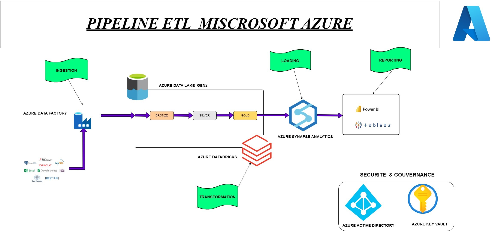

# Flight_radar

## PROJET FLIGHTRADAR24

 Pour la réalisation de ce projet, j'ai adopté pour une approche basée sur un développement local suivant une architecture medaillon. Voici les étapes détaillées du workflow:

1.  # Extraction des Données:

 J'ai utilisé l'API de Flightradar24 (https://www.flightradar24.com/) pour extraire les données pertinentes pour notre analyse.
 Pour faciliter cette extraction, j'ai fait appel à la bibliothèque FlightRadarAPI qui offre une interface optimisée pour cette API. La logique et les scripts d'extraction sont documentés dans le **BRONZE.py**. Une fois les données extraites, elles sont stockées dans ce que nous appelons le conteneur "bronze" (bronze container).

2.  # Premiere transformation des données:

 Après avoir extrait les données localement, le fichier **SILVER.py** joue un rôle central dans lequel j'ai réalisé mes premières transformations sur ces données, puis sauvegardé les résultats obtenus sur un nouveau format et dans le conteneur "silver" (silver containers).

3. # Transformation final des données 
Dans le fichier **GOLDS.py** , j'ai réalisé les toutes dernières transformations pour nettoyer et préparer les données de manière optimale. Une fois les données prêtes, je les ai sauvegardées localement dans un conteneur nommé "gold" (gold containers). Je sollicite dès maintenant les experts du domaine pour valider et analyser ces données.

3. # Analyse et Visualisation:

 Avec les données nettoyées en place, j'ai procédé à l'analyse des indicateurs clés de performance (KPI)  pour notre projet.
 Les resultats et les insights extraits de notre ensemble de données sont présentés de manière exhaustive dans le notebook Resultats.ipynb.

### PIPELINE ETL SUR AZURE

 Bien que l'infrastructure complète n'ait pas encore été déployée dans le cloud, j'ai élaboré un schéma représentant l'architecture envisagée pour le pipeline ETL. Vous trouverez ce schéma à l'adresse suivante :

 Voici les composants clés de notre solution:

1. # Source de Données

 FlightRadar24 API : Nous utiliserons l'API de FlightRadar24 (https://www.flightradar24.com/) comme source initiale de nos données.

2. # Azure Data Factory

 Azure Data Factory, un service d'intégration de données d'Azure, jouera le rôle principal dans l'orchestration et l'automatisation de notre pipeline ETL.
 Nous utiliserons spécifiquement l'activité "Copy Data" d'Azure Data Factory pour ingérer les données depuis notre source initiale vers Azure Data Lake Gen2.

3. # Azure Data Lake Storage Gen2

 Azure Data Lake Storage Gen2, une solution de stockage sur Azure, stockera nos données. Il est conçu pour gérer de grands volumes de données structurées et non structurées tout en fournissant des capacités d'analyse.
 Azure Databricks

4. # Azure Databricks 
 Il sera utilisé pour le traitement distribué et les transformations complexes de nos données. Cette plateforme unifiée permet une collaboration efficace et un traitement en temps réel.

5. # Azure Synapse Analytics

 Avec Azure Synapse, nous créerons et gérerons nos tables d'entrepôt de données, offrant ainsi une plateforme analytique intégrée pour la BI et le big data.

6. # PowerBI
 Microsoft Power BI, notre outil de choix pour la visualisation, permettra d'extraire des insights pertinents et de visualiser nos KPI de manière interactive.

7. # Azure Active Directory (Azure AD)

 Azure AD sera au cœur de notre stratégie de gestion des identités et des accès. Il offrira une authentification sécurisée et une gestion granulaire des autorisations pour tous nos services Azure.

8. # Azure Key Vault

 Pour garantir la sécurité de nos informations sensibles, nous utiliserons Azure Key Vault. Ce service d'Azure est dédié à la gestion sécurisée des secrets, des clés d'API et d'autres informations critiques.

## Industrialisation 

1. # Fault-Tolerant:

 Avec ses capacités d'orchestration, ADF permet de gérer les erreurs, de reprendre les jobs après des échecs, et d'envoyer des alertes en cas d'erreur. Avec **RETRY POLICY** on peut spécifier combien de fois une activité doit être réessayée en cas d'échec et combien de temps attendre entre chaque essai. Pour ressoudre un probleme de donnée corrumpue on peut de ce fait faire une Gestion des exceptions
 

2. # Observable:

 -**Azure Monitor** fournit des données de télémétrie complètes de l'ensemble d' environnement Azure. On peut visualiser ces données, les analyser et y répondre via des alertes, des tableaux de bord visuels et des règles d'automatisation.
 - **Log Analytics**  est un service au sein d'Azure Monitor qui va nous permettre de collecter et d'analyser les données de télémétrie des ressources Azure.
 -**Alerting** : On peut  configurer des alertes pour être informé en temps réel de tout dysfonctionnement ou échec. 

3. # Systématique:

 -Azure Data Lake Storage Gen2 : Ce service va stocker des données structurées et non structurées. Ici, on peut organiser les données en dossiers et sous-dossiers en utilisant la nomenclature horodatée indiquée Flights/rawzone/tech_year=2023/tech_month=2023-07/tech_day=2023-07-16/flights2023071619203001.csv,soit manuellement à l'aide de l'interface utilisateur du portail ou automatiquement via SDK/Azure CLI. 

4. # Automatisation:

 Azure Data Factory : ADF permet d'automatiser l'exécution des pipelines ETL à des intervalles réguliers en utilisant des déclencheurs spécifiques. Par exmple pour que notre piprline s'execute tous les 2 heures on peut utiliser (schedule trigger)

